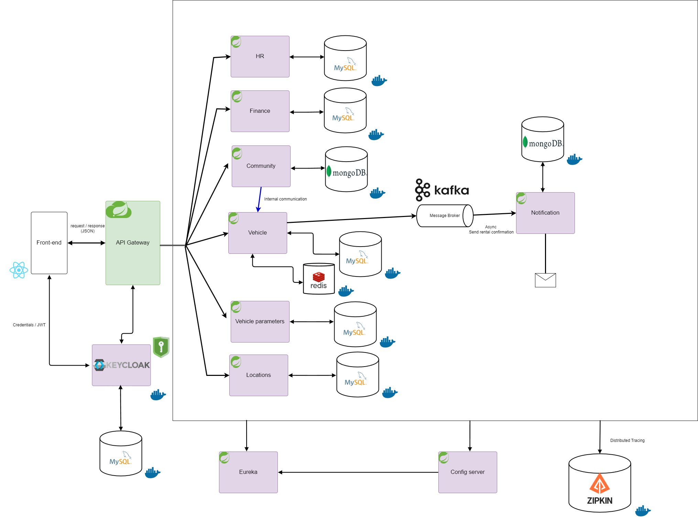

# Vehicle Rental Management System

## Description
The Vehicle Rental Management System is a comprehensive full-stack application. This project aims to manage various aspects of vehicle rental operations through a microservices architecture. It includes services for vehicle management, location services, community management, finance tracking, and human resources configuration. The system provides a web interface, APIs, and extensive documentation.

## Features
- **Vehicle Service:** Manages vehicles, hires, maintenance, and movements.
- **Location Service:** Handles locations, countries, and states.
- **Community Service:** Manages clients, suppliers, and employees.
- **Finance Service:** Oversees invoices and financial transactions.
- **Vehicle Parameters:** Includes vehicle make, model, status, and type.
- **HR Configuration Service:** Manages job titles and employee types.
- **Web Interface:** User-friendly UI for interaction with the system.
- **Email Notifications:** Sends confirmation emails upon order creation.
- **Microservices Architecture:** Includes a detailed diagram of the architecture.
- **UI and Postman Screenshots:** Provides screenshots of the UI and Postman collections for better understanding and demonstration.
- **Swagger Documentation:** Detailed API documentation is available through Swagger, allowing easy exploration of the API endpoints and their usage.

## Technical Stack
### Backend
- **Java** and **Spring** framework
- **REST API** for service communication
- **MySQL** and **MongoDB** databases
- **Redis** for caching
- **Docker** for containerization
- **Kafka** for message streaming
- **Swagger** for API documentation
- **Maildev** for email notifications
- **Zipkin** for distributed tracing
- **Keycloak** for authentication and authorization
- **OpenFeign** for HTTP client
- **Spring Cloud** and **Gateway** for microservice management
- **JUnit**, **Mockito** for unit and integration testing

### Frontend
- **JavaScript** and **React** for interactive UI
- **Bootstrap** for styling
- **Axios** for HTTP requests
- **Keycloak** for authentication and authorization

## Usage
- **Web Interface:** Interact with the system through the web interface provided by the application.
- **API Testing:** Use the Postman collections provided in the `postman` folder to test and explore the APIs.
- **Swagger Documentation:** Each microservice has its own Swagger UI for interactive API documentation and testing. Refer to the project's documentation or service configuration to access the specific Swagger UI for each microservice.
- **Architecture Diagram:** Below is the diagram of the microservices architecture:

